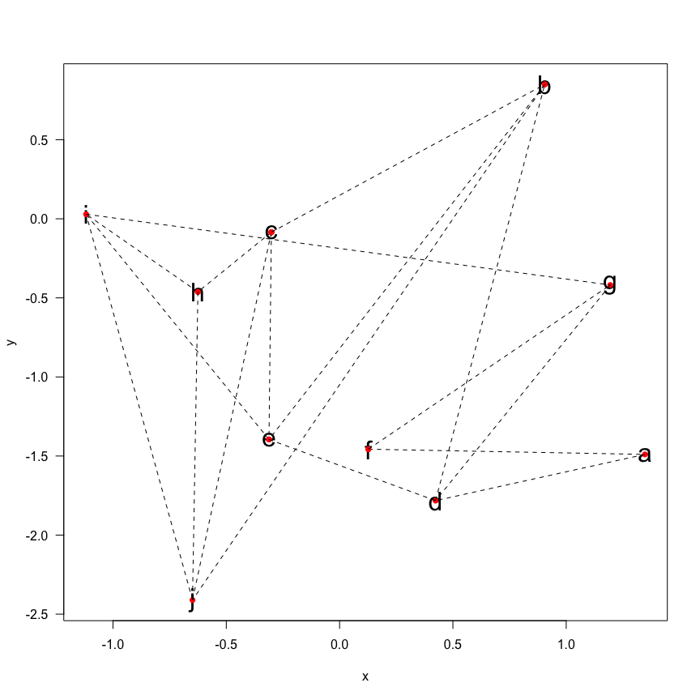
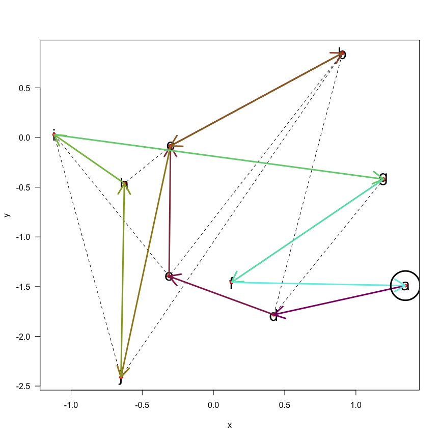
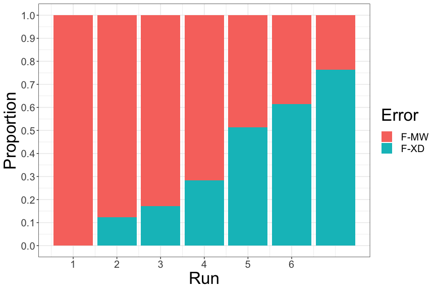

pathfinder: an algorithm for finding the most efficient path between
waypoints - Part I
================
RKOpTris
2024-04-21

## Abstract

Come with me on a journey to write an algorithm from scratch which finds
the most efficient path between a set of waypoints with a variety of
paths between them. (I’m adding to this document intermittently and
iteratively and represents a work in progress.)

## Introduction

My girlfriend and I enjoy running orienteering races where we are given
a map with some waypoints to reach. The idea is, from the start point,
to reach as many waypoints and get to the finish waypoint (usually the
starting one) within a certain time. You get points for each waypoint
you reach, but points get deducted if you exceed the race length time;
the more points tthe later you are!

I thought it would be fun to write and algorithm that helps us plan a
route, given the speed we typically run at, the topography, etc.

Writing this from scratch, I am starting with a “dumb” algorithm, and
then working iteratively to improve it and then integrate features such
as topography and fatigue. We start with generating some points and
paths at random in order to build our algorithm from the ground up.

### Methods and R code

Okay, so first thing is, is to produce some randomly generated \[x, y\]
waypoints and some randomly generated paths that join them. A waypoint
may have many paths connecting it to others, or only one. Here’s a few
functions to do that, and then we’ll visualise them.

``` r
library(dplyr)
```

    ## 
    ## Attaching package: 'dplyr'

    ## The following objects are masked from 'package:stats':
    ## 
    ##     filter, lag

    ## The following objects are masked from 'package:base':
    ## 
    ##     intersect, setdiff, setequal, union

``` r
# this function randomly using rnorm() generates a set of points (x and y coordinates)
generate_points <- function(n, mean = 0, sd = 1){
  data.frame(waypoint = letters[1:n],
             x = rnorm(n, mean, sd),
             y = rnorm(n, mean, sd))
}

# this function randomly generates some path between a points object created with generate_points. it is written so that there must be at least one path to/from each point, but could generate many (= greater computation required when running the algorithm)
generate_paths <- function(){
  waypoints <- my_points$waypoint
  p1 <- c()
  while(length(unique(p1)) < length(waypoints)){
    p1 <- c(p1, sample(waypoints, 1))
  }
  p2 <- sample(waypoints, length(p1), replace = T)
  paths <- data.frame(p1, p2)
  #remove p1 == p2
  paths <- paths[-which(paths$p1 == paths$p2), ]
  row.names(paths) <- NULL
  #remove duplicates
  duplicates <- c()
  for(i in 1:(nrow(paths) - 1)){
    p2 <- paths$p1[i]
    p1 <- paths$p2[i]
    rem <- paths[(i + 1):nrow(paths), ]
    dup <- rem[rem$p1 == p1 & rem$p2 == p2, ]
    if(length(dup) < 0){
      next
    } else {
      duplicates <- c(duplicates, as.numeric(row.names(dup)))
    }
  }
  paths <- paths[-duplicates, ]
  paths
}

# this function gets the [x, y] coordinates from object x for a certain waypoint (e.g., "a")
get_pos <- function(x, waypoint){
  as.numeric(x[x$waypoint == waypoint, c("x", "y")])
}

# this function plots the points and paths. it's just a quick, no-frills plot
visualise_paths <- function(){
  plot(y ~ x, my_points, type = "n", las = 1)
  text(y ~ x, my_points, labels = waypoint, cex = 2)
  
  a2b <- my_paths
  for(i in 1:nrow(a2b)){
    p1 <- a2b$p1[i]
    p2 <- a2b$p2[i]
    a <- get_pos(my_points, p1)
    b <- get_pos(my_points, p2)
    points(a[1], a[2], col = "red", pch = 16)
    arrows(a[1], a[2], b[1], b[2], length = 0, lty = 2)
  }
}

# calculates the distance between waypoint p1 and waypoint p2
get_distance <- function(p1, p2){
  distances <- my_points %>% tibble::column_to_rownames("waypoint") %>% dist(upper = T, diag = T) %>% as.matrix()
  distances[p1, p2]
}

# this is a wrapper function for generate_points() which allows the setting of a seed which is useful for reproducibility in this example
init_points <- function(n_points = 10, my_seed = 1138, seed_n = 2){
  set.seed(my_seed)
  for(i in 1:seed_n){
    my_points <- generate_points(n_points, 0)
  }
  my_points
}

# this is a wrapper function for generate_paths() which also allows the setting of a seed
init_paths <- function(){
  my_paths <- generate_paths()
  distances <- my_points %>% tibble::column_to_rownames("waypoint") %>% dist(upper = T, diag = T) %>% as.matrix()
  for(i in 1:nrow(my_paths)){
    my_paths$distance[i] <- get_distance(my_paths$p1[i], my_paths$p2[i])
  }
  my_paths
}

# generating the points and paths, and plotting...
my_points <- init_points()
my_paths <- init_paths()
visualise_paths()
```

<!-- -->

So now we’ve got some points and paths, let’s write an algorithm to find
the most efficient route. In this instance, the start point is also the
finish point (like these orienteering races I run). And to start, my
algorithm is going to search randomly for a set number of runs, in the
hope that over many iterations that the most efficient route is
discovered. (So, at this point, we won’t technically know whether it is
ACTUALLY the most efficient, but it’s a starting point.)

I’m going to declare some variables. Some global ones deal with how the
model runs and what the model outputs. Hopefully they are
self-explanatory, but these are variables that determine the
start/finish waypoint, how many runs are attempted, how many times a
algorithm can visit the same point, etc. This is in addition to
recording the path of successful start-finish return journeys and the
distances of those successful journeys:

``` r
reset_global_vars <- function(start_waypoint){
  global_vars$total_runs <- 0
  global_vars$total_attempts <- 0
  global_vars$max_runs <- 100000
  global_vars$successful_routes <- list()
  global_vars$successful_distances <- numeric()
  global_vars$successful_runs <- numeric()
  global_vars$run_code <- character()
  global_vars$start_waypoint <- start_waypoint
  global_vars$max_visits <- 3
  global_vars$number_successes <- 0
  global_vars$number_fails <- 0
  global_vars$best_distance_success <- Inf
  global_vars$search_runtime <- 0
}
```

And also a set of variables which will be changed as the algorithm runs
and which help guide the algorithm, and also, for instance, records the
reason a journey failed (such as visiting the same point too many
times):

``` r
reset_run_vars <- function(){
  run_vars$current_waypoint <- NA
  run_vars$distance_travelled <- 0
  run_vars$route_travelled <- c()
  run_vars$all_points_visited <- F
  run_vars$fail_reason <- ""
  run_vars$search_runs <- 0
  run_vars$waypoint_probs <- matrix(1, nrow = nrow(my_points), dimnames = list(my_points$waypoint))
}
```

Being that the algorithm will be searching randomly for paths between
points and returning to the start, we’ll define success/fail functions:

``` r
fail_run <- function(record_all_codes){
  #message(paste("Search failed because", run_vars$fail_reason))
  #message(global_vars$total_runs)
  global_vars$number_fails <- global_vars$number_fails + 1
  if(record_all_codes){
    error_code <- ifelse(run_vars$fail_reason == "exceeded best distance", "F-XD", "F-MW")
    global_vars$run_code <- c(global_vars$run_code, error_code)
  }
  reset_run_vars()
  global_vars$total_attempts <- global_vars$total_attempts + 1
}

succeed_run <- function(record_all_codes){
  message(paste0(global_vars$total_runs, ": path found!"))
  global_vars$number_successes <- global_vars$number_successes + 1
  global_vars$successful_routes[[global_vars$number_successes]] <- c(global_vars$start_waypoint, run_vars$route_travelled)
  global_vars$successful_distances[global_vars$number_successes] <- run_vars$distance_travelled
  global_vars$successful_runs <- c(global_vars$successful_runs, global_vars$total_runs)
  if(record_all_codes){
    global_vars$run_code <- c(global_vars$run_code, "S")
  }
  reset_run_vars()
  global_vars$total_attempts <- global_vars$total_attempts + 1
}
```

When there’s been a successul start-finish run, the success of that run
is recorded in the global_vars environment:

``` r
report_success <- function(){
  list(
    search_runtime <- global_vars$search_runtime,
    total_runs = global_vars$total_runs,
    best_distance_success = global_vars$best_distance_success,
    best_route = global_vars$successful_routes[[length(global_vars$successful_routes)]],
    successful_distances = global_vars$successful_distances,
    successful_routes = global_vars$successful_routes,
    successful_runs = global_vars$successful_runs,
    run_code = global_vars$run_code
  )
}
```

This is the main loop with parameters that define the start/end point,
the maximum number of visits there can be to any one waypoint, and the
maximum number of runs to attempt. Further to those, it offers the
chance to record the fail codes. You will notice a visit_penalty
parameter. This was implemented later, but is key from turning the
algorithm into completely stupid, to being somewhat discerning; if a
point has already been visited then it will reduce the probability that
it can visit that point again. But in a choice between two waypoints
that have already been visited the same number of times, then there is
an equal probability that it will choose either of them. And here is a
bit of pseudocode that highlights the basics of how the algorithm works
(at it’s most stupid, and we will be making it a bit more discerning
later on):

``` r
while a predefined maximum number of runs has not ben reached:
  attempt by random choice to get from start/finish waypoint by visiting all other 
  waypoints at least once, not exceeding the maximum allowed distance and not
  exceeding the maximum number of visits for each waypoint
    if success:
      set distance travelled as the maximum allowed distance for further loops 
      report success
      reset the run
    else if fail:
      report reason for failure
      reset the run
```

Here we define the main loop. There is a bit more in here, but on our
initial run it will behave according to the pseudocode above.

``` r
find_path <- function(start_waypoint = "a", max_visits = 3, max_runs = 100000, record_all_codes = T, visit_penalty = 0.25){
  start_time <- Sys.time()
  reset_run_vars()
  reset_global_vars(start_waypoint)
  global_vars$start_waypoint <- start_waypoint
  global_vars$max_runs <- max_runs
  global_vars$max_visits <- max_visits
  #while(global_vars$total_runs < global_vars$max_runs){
  while(global_vars$number_successes < 20 & global_vars$total_runs < global_vars$max_runs){
    
    if(global_vars$total_runs == 0){
      reset_run_vars()
    }
    
    global_vars$total_runs <- global_vars$total_runs + 1
    run_vars$search_runs <- run_vars$search_runs + 1
    
    # travelling loop
    if(run_vars$distance_travelled == 0){
      (run_vars$current_waypoint <- global_vars$start_waypoint)
      run_vars$waypoint_probs[run_vars$current_waypoint, 1] <- run_vars$waypoint_probs[run_vars$current_waypoint, 1] * visit_penalty
    } else {
      (run_vars$current_waypoint <- run_vars$route_travelled[length(run_vars$route_travelled)])
      run_vars$waypoint_probs[run_vars$current_waypoint, 1] <- run_vars$waypoint_probs[run_vars$current_waypoint, 1] * visit_penalty
      ##### this may not be the best place to put this!
      if(run_vars$distance_travelled > global_vars$best_distance_success){
        run_vars$fail_reason <- "exceeded best distance"
        fail_run(record_all_codes)
        next
      }
    }
    
    successful_runs <- length(global_vars$successful_distances)
    if(successful_runs > 4 && length(table(global_vars$successful_distances[length(global_vars$successful_distances):(length(global_vars$successful_distances) - 2)])) == 1){
      report_success()
      print("Best solution likely found!")
      break
    }
    
    if(length(table(run_vars$route_travelled)) == nrow(my_points)){
      run_vars$all_points_visited <- T
    }
    
    if(run_vars$all_points_visited && run_vars$current_waypoint == global_vars$start_waypoint){
      global_vars$best_distance_success <- run_vars$distance_travelled
      succeed_run(record_all_codes)
      next
    }
    if(length(run_vars$route_travelled) > 0){
      if(any(table(run_vars$route_travelled) > global_vars$max_visits)){
        run_vars$fail_reason <- "visiting waypoint too many times"
        fail_run(record_all_codes)
        next
      }
    }
    # get waypoint options and select one at random
    all_paths <- rbind(my_paths,
                       rename(my_paths[c(2, 1, 3)], p1 = p2, p2 = p1))
    (possible_destinations <- all_paths %>% filter(p1 == run_vars$current_waypoint))
    run_vars$waypoint_probs
    (weighted_probs <- run_vars$waypoint_probs[possible_destinations$p2, 1])
    (weighted_probs <- weighted_probs / sum(weighted_probs))
    # travel
    (chosen_destination <- possible_destinations[sample(1:nrow(possible_destinations), 1, prob = weighted_probs), ])
    # update route_travelled
    (run_vars$route_travelled <- c(run_vars$route_travelled, chosen_destination$p2))
    # update distance_travelled
    (run_vars$distance_travelled <- run_vars$distance_travelled + chosen_destination$distance)
  }
  global_vars$search_runtime <- Sys.time() - start_time
  report_success()
}
```

And again on reproducibility, we’ll use the withSeed() function
available in my r-useful-funs repository that we’ll use for executing
the main loop so that it will always gives the same result, for me and
for you. This is handy for demonstration particularly as the main loop
uses randomness to navigate the paths between waypoints.

``` r
withSeed <- function(expr, seed = 42) {
  # inspired by Romain François, Theodore Lytras, Gwang-Jin Kim on Stack Exchange
  # https://stackoverflow.com/questions/14324096/setting-seed-locally-not-globally-in-r
  if(!exists(".Random.seed")){runif(1); existing.seed <- NULL}
  existing.seed <- .Random.seed
  on.exit({assign(".Random.seed", existing.seed, envir = .GlobalEnv)})
  set.seed(seed)
  expr
}
```

And we’ll define some functions that we’ll use post-run to analyse the
general performance of the algorithm (and we’ll also need the package
stringr). So there are a lot of functions being declared at the moment,
but once we get past the initial analysis, it will make everything more
streamlined.

``` r
library(stringr)

# gives a summary for the error codes (returned as a list)
error_code_summary <- function(run_object){
  start_runs <- which(run_object$run_code == "S") - 1
  run_analysis <- run_object$run_code %>% paste(collapse = ",") %>% str_split(",S,") %>% sapply(str_split, ",")
  run_analysis <- sapply(run_analysis, table)
  lapply(run_analysis, function(x){
    y <- x %>% data.frame()
    names(y) <- c("Error", "Frequency")
    y$Proportion <- y$Frequency / sum(y$Frequency)
    y
  })
}

# converts the summary for the error codes into a more generally- and plot-friendly data frame
error_code_for_plot <- function(error_code_summary_data){
  do.call(rbind, lapply(1:length(error_code_summary_data), function(x){
    y <- error_code_summary_data[[x]]
    y$Run <- x
    y
  }))
}

# and this plots the error codes
plot_error_codes <- function(x){
  x %>% 
    error_code_summary %>% 
    error_code_for_plot %>%
    ggplot(aes(Run, Proportion, fill = Error)) + 
    scale_y_continuous(breaks = seq(0, 1, 0.1)) +
    scale_x_continuous(breaks = seq(1, length(x$successful_runs))) +
    geom_bar(stat = "identity", position = "fill") +
    theme_bw() +
    theme(axis.title = element_text(size = 25),
          axis.text = element_text(size = 15),
          legend.title = element_text(size = 25),
          legend.text = element_text(size = 15))
}

# atomises a path-taken vector, e.g. "abcba" into ["a", "b", "c", "b", "a"]
str_to_waypoints <- function(string){
  string %>% str_split("") %>% unlist()
}

# conversely collpases vector ["a", "b", "c", "b", "a"] into "abcba"
waypoints_to_str <- function(waypoints){
  paste(waypoints, collapse = "")
}

# gets the path taken from start to finish
get_path <- function(charvec){
  data.frame(p1 = charvec[1:(length(charvec) - 1)],
             p2 = charvec[2:length(charvec)])
}

# plots the path by superimposing onto existing visualise_paths() plot
plot_path <- function(charvec){
  path_taken <- get_path(charvec)
  p1 <- path_taken$p1
  p2 <- path_taken$p2
  path_taken1 <- my_points[match(p1, my_points$waypoint), ]
  path_taken2 <- my_points[match(p2, my_points$waypoint), ]
  plot_cols <- scico::scico(length(charvec), palette = "hawaii")
  arrows(path_taken1$x, path_taken1$y, path_taken2$x, path_taken2$y, col = plot_cols, lwd = 3)
  points(path_taken1$x[1], path_taken1$y[1], cex = 8, lwd = 3)
}

# get the total distance of the path from start to finish
get_path_length <- function(charvec){
  path_taken <- get_path(charvec)
  for(i in 1:nrow(path_taken)){
    path_taken$distance[i] <- get_distance(path_taken$p1[i], path_taken$p2[i])
  }
  sum(path_taken$distance)
}
```

Finally! Let’s run the code (without any visit_penalty which, perhaps,
counterintuitively is set to 1, where a number closer to 0 is a greater
penalty - it is a probability multiplier). Then we’ll look at the
output!

``` r
global_vars <- new.env()
run_vars <- new.env()

my_points <- init_points()
my_paths <- init_paths()
visualise_paths()
run1 <- withSeed(find_path(max_runs = 50000, visit_penalty = 1), seed = 42)
```

    ## 52: path found!

    ## 945: path found!

    ## 1398: path found!

    ## 2148: path found!

    ## 2640: path found!

    ## 11669: path found!

``` r
plot_path(run1$best_route)
```

<!-- -->

So this is the path that was found without any penalty in place, and the
most basic performance of the algorithm (not so good/efficient).

To interpret the visualise_paths() output the first path starts as a
purple arrow and gradually becomes green/yellow and gradually again
becomes cyan at the finish. You might notice at “c” that it travels to
“b” but then returns to “c” and so it appears as a double ended arrow
(one plotted on top of the other). Note that “c” does not connect to “g”
or “i” even though that path does pass by closely.

This is what the output of the model looks like, which we can use to
assess and, with further tweaks to the way the algorithm works, improve
it. We can see it took about 1.5 minutes, the waypoints of the paths it
took, and their distances. And some other stuff… I should say that the
path distance traveled is NOT the best it could have done, so there’s
room for improvement there, if not in other areas.

``` r
run1[1:(length(run1) - 1)]
```

    ## [[1]]
    ## Time difference of 1.495612 mins
    ## 
    ## $total_runs
    ## [1] 50000
    ## 
    ## $best_distance_success
    ## [1] 16.22612
    ## 
    ## $best_route
    ##  [1] "a" "d" "e" "c" "b" "c" "j" "h" "i" "g" "f" "a"
    ## 
    ## $successful_distances
    ## [1] 33.79378 32.24116 28.28956 23.64401 20.94470 16.22612
    ## 
    ## $successful_routes
    ## $successful_routes[[1]]
    ##  [1] "a" "d" "b" "c" "b" "e" "i" "j" "c" "j" "h" "c" "h" "j" "i" "e" "i" "g" "f"
    ## [20] "a"
    ## 
    ## $successful_routes[[2]]
    ##  [1] "a" "f" "g" "f" "g" "d" "b" "e" "i" "e" "b" "e" "c" "j" "h" "i" "g" "f" "a"
    ## 
    ## $successful_routes[[3]]
    ##  [1] "a" "f" "a" "f" "g" "i" "h" "i" "j" "h" "c" "b" "c" "j" "i" "e" "d" "g" "d"
    ## [20] "a"
    ## 
    ## $successful_routes[[4]]
    ##  [1] "a" "d" "b" "e" "i" "g" "i" "j" "c" "h" "i" "g" "f" "a"
    ## 
    ## $successful_routes[[5]]
    ##  [1] "a" "f" "a" "f" "g" "i" "j" "h" "c" "h" "c" "e" "b" "d" "a"
    ## 
    ## $successful_routes[[6]]
    ##  [1] "a" "d" "e" "c" "b" "c" "j" "h" "i" "g" "f" "a"
    ## 
    ## 
    ## $successful_runs
    ## [1]    52   945  1398  2148  2640 11669

And printed separately here, it also records the reason that a run was
abandoned. Because the algorithm is running in “stupid mode” it could
visit waypoints “a” and “b” forever (though it would be unlikely to do
so). We have built in to the algorithm ways to fail a run if it visits
the same waypoint too many times (F-MW) or exceeds the maximum-allowed
distance (F-XD), which gets updated each time the algorithm is
successful in finding a new (shorter) route.

``` r
run1$run_code[1:500]
```

    ##   [1] "F-MW" "F-MW" "S"    "F-MW" "F-MW" "F-XD" "F-MW" "F-MW" "F-MW" "F-MW"
    ##  [11] "F-MW" "F-MW" "F-MW" "F-MW" "F-MW" "F-MW" "F-MW" "F-MW" "F-MW" "F-MW"
    ##  [21] "F-MW" "F-MW" "F-MW" "F-MW" "F-MW" "F-XD" "F-MW" "F-MW" "F-MW" "F-MW"
    ##  [31] "F-MW" "F-XD" "F-MW" "F-MW" "F-MW" "F-MW" "F-MW" "F-MW" "F-MW" "F-XD"
    ##  [41] "F-MW" "F-XD" "F-XD" "F-MW" "F-MW" "F-XD" "F-MW" "F-MW" "F-MW" "F-MW"
    ##  [51] "F-MW" "F-MW" "F-MW" "F-MW" "F-MW" "F-MW" "F-MW" "F-MW" "F-MW" "F-MW"
    ##  [61] "S"    "F-MW" "F-MW" "F-XD" "F-XD" "F-MW" "F-MW" "F-MW" "F-MW" "F-MW"
    ##  [71] "F-MW" "F-MW" "F-XD" "F-MW" "F-MW" "F-MW" "F-MW" "F-MW" "F-MW" "F-MW"
    ##  [81] "F-XD" "F-MW" "F-MW" "F-MW" "F-MW" "F-MW" "F-MW" "F-XD" "F-MW" "F-MW"
    ##  [91] "S"    "F-MW" "F-XD" "F-XD" "F-MW" "F-XD" "F-MW" "F-MW" "F-MW" "F-MW"
    ## [101] "F-XD" "F-MW" "F-MW" "F-MW" "F-MW" "F-MW" "F-MW" "F-MW" "F-XD" "F-MW"
    ## [111] "F-MW" "F-MW" "F-MW" "F-XD" "F-MW" "F-MW" "F-XD" "F-XD" "F-XD" "F-MW"
    ## [121] "F-MW" "F-MW" "F-MW" "F-MW" "F-MW" "F-MW" "F-MW" "F-XD" "F-XD" "F-MW"
    ## [131] "F-MW" "F-MW" "F-MW" "F-XD" "F-MW" "F-MW" "F-MW" "F-XD" "F-MW" "F-MW"
    ## [141] "F-XD" "F-XD" "F-MW" "F-MW" "S"    "F-XD" "F-MW" "F-XD" "F-MW" "F-MW"
    ## [151] "F-XD" "F-XD" "F-MW" "F-MW" "F-XD" "F-XD" "F-MW" "F-MW" "F-XD" "F-XD"
    ## [161] "F-XD" "F-MW" "F-MW" "F-XD" "F-MW" "F-XD" "F-XD" "F-XD" "F-MW" "F-XD"
    ## [171] "F-MW" "F-XD" "F-MW" "F-MW" "F-XD" "F-XD" "F-MW" "F-MW" "F-XD" "F-MW"
    ## [181] "S"    "F-MW" "F-XD" "F-XD" "F-XD" "F-MW" "F-XD" "F-MW" "F-XD" "F-MW"
    ## [191] "F-MW" "F-MW" "F-MW" "F-XD" "F-XD" "F-XD" "F-XD" "F-XD" "F-XD" "F-MW"
    ## [201] "F-XD" "F-MW" "F-XD" "F-XD" "F-XD" "F-XD" "F-MW" "F-XD" "F-MW" "F-MW"
    ## [211] "F-XD" "F-MW" "F-XD" "F-MW" "F-MW" "F-MW" "F-MW" "F-MW" "F-MW" "F-MW"
    ## [221] "F-MW" "F-MW" "F-MW" "F-XD" "F-XD" "F-MW" "F-MW" "F-MW" "F-XD" "F-XD"
    ## [231] "F-XD" "F-XD" "F-MW" "F-XD" "F-MW" "F-XD" "F-MW" "F-XD" "F-XD" "F-XD"
    ## [241] "F-XD" "F-XD" "F-XD" "F-XD" "F-XD" "F-XD" "F-MW" "F-XD" "F-XD" "F-XD"
    ## [251] "F-XD" "F-XD" "F-XD" "F-XD" "F-MW" "F-MW" "F-MW" "F-MW" "F-XD" "F-XD"
    ## [261] "F-MW" "F-MW" "F-MW" "F-XD" "F-XD" "F-XD" "F-XD" "F-XD" "F-XD" "F-XD"
    ## [271] "F-MW" "F-MW" "F-XD" "F-XD" "F-XD" "F-MW" "F-XD" "F-MW" "F-XD" "F-MW"
    ## [281] "F-XD" "F-MW" "F-MW" "F-XD" "F-XD" "F-XD" "F-MW" "F-XD" "F-XD" "F-MW"
    ## [291] "F-XD" "F-XD" "F-MW" "F-MW" "F-XD" "F-MW" "F-MW" "F-XD" "F-XD" "F-MW"
    ## [301] "F-XD" "F-XD" "F-MW" "F-XD" "F-MW" "F-MW" "F-XD" "F-MW" "F-XD" "F-MW"
    ## [311] "F-MW" "F-XD" "F-MW" "F-MW" "F-XD" "F-XD" "F-MW" "F-XD" "F-XD" "F-MW"
    ## [321] "F-MW" "F-XD" "F-MW" "F-XD" "F-XD" "F-XD" "F-XD" "F-MW" "F-XD" "F-XD"
    ## [331] "F-XD" "F-MW" "F-XD" "F-XD" "F-XD" "F-XD" "F-XD" "F-XD" "F-MW" "F-MW"
    ## [341] "F-XD" "F-XD" "F-XD" "F-MW" "F-XD" "F-XD" "F-MW" "F-MW" "F-XD" "F-MW"
    ## [351] "F-XD" "F-XD" "F-XD" "F-XD" "F-XD" "F-XD" "F-MW" "F-XD" "F-XD" "F-XD"
    ## [361] "F-XD" "F-MW" "F-XD" "F-XD" "F-XD" "F-XD" "F-MW" "F-MW" "F-XD" "F-XD"
    ## [371] "F-MW" "F-MW" "F-MW" "F-XD" "F-XD" "F-MW" "F-XD" "F-XD" "F-XD" "F-MW"
    ## [381] "F-XD" "F-MW" "F-MW" "F-XD" "F-XD" "F-MW" "F-MW" "F-MW" "F-XD" "F-MW"
    ## [391] "F-XD" "F-XD" "F-XD" "F-XD" "F-XD" "F-XD" "F-MW" "F-MW" "F-XD" "F-XD"
    ## [401] "F-MW" "F-XD" "F-XD" "F-XD" "F-MW" "F-MW" "F-XD" "F-XD" "F-XD" "F-XD"
    ## [411] "F-XD" "F-XD" "F-XD" "F-MW" "F-XD" "F-MW" "F-XD" "F-MW" "F-XD" "F-XD"
    ## [421] "F-MW" "F-MW" "F-MW" "F-XD" "F-MW" "F-XD" "F-MW" "F-XD" "F-XD" "F-XD"
    ## [431] "F-XD" "F-MW" "F-MW" "F-XD" "F-XD" "F-XD" "F-XD" "F-XD" "F-MW" "F-XD"
    ## [441] "F-MW" "F-XD" "F-MW" "F-MW" "F-XD" "F-XD" "F-MW" "F-XD" "F-MW" "F-XD"
    ## [451] "F-XD" "F-XD" "F-XD" "F-XD" "F-XD" "F-XD" "F-XD" "F-XD" "F-XD" "F-XD"
    ## [461] "F-MW" "F-XD" "F-MW" "F-XD" "F-XD" "F-MW" "F-XD" "F-MW" "F-MW" "F-MW"
    ## [471] "F-MW" "F-MW" "F-MW" "F-XD" "F-XD" "F-XD" "F-XD" "F-MW" "F-XD" "F-XD"
    ## [481] "F-XD" "F-XD" "F-XD" "F-XD" "F-XD" "F-MW" "F-MW" "F-MW" "F-MW" "F-MW"
    ## [491] "F-XD" "F-MW" "F-MW" "F-MW" "F-XD" "F-MW" "F-XD" "F-XD" "F-MW" "F-XD"

And for a reference, let’s see what proportion of error codes we’re
getting in “stupid mode”. Each “run” in this case is actually the
proportion of the types of failures of runs between successes. I should
probably revise the nomenclature ;-)

``` r
library(ggplot2)
plot_error_codes(run1)
```

<!-- -->

From the error codes we can see that the main cause of run fails is
visiting waypoints multiple times (F-MW), but as the maximum-allowed
distance gets shorter then that corresponding error code begins to
dominate (simply because it can easily exceed the maximum-allowed
distance by metaphorically “dithering”.

So let’s conclude part one, and see what we can do to improve “stupid
mode” in the next part! Hopefully see you there… :-)
