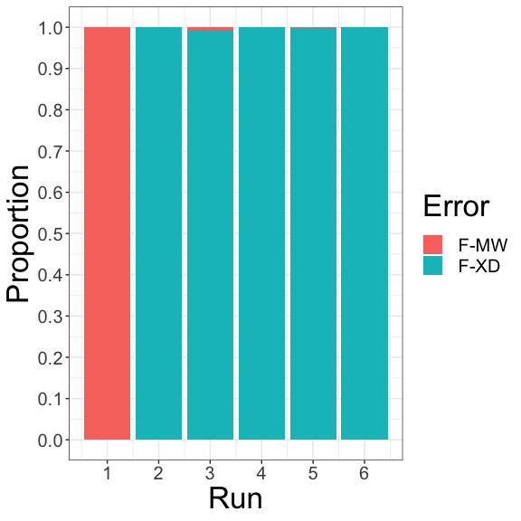
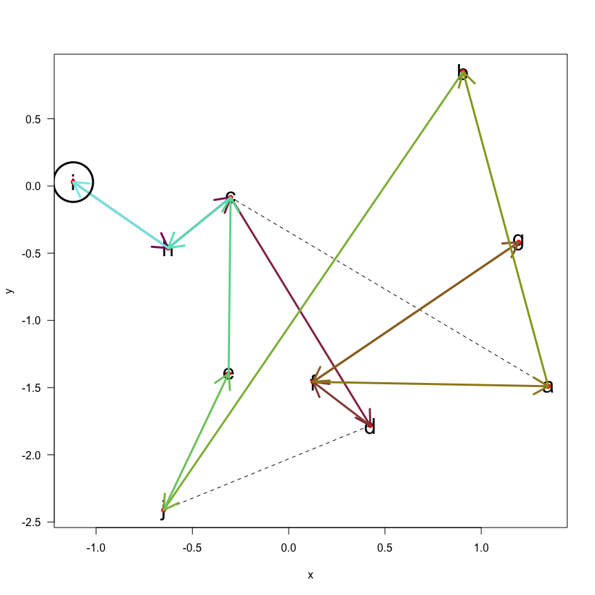
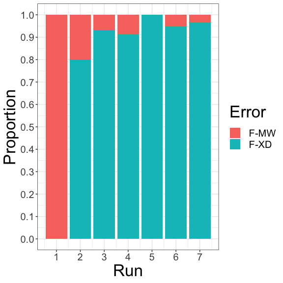

pathfinder: an algorithm for finding the most efficient path between
waypoints - Part II - Being less stupid
================
RKOpTris
2024-04-21

## Abstract

This is a continuation of a journey to write an algorithm from scratch
which finds the most efficient path between a set of waypoints with a
variety of paths between them. (I’m adding to this document
intermittently and iteratively and represents a work in progress.)

Welcome to Part Deux!

## Introduction

In the first part of this series we wrote a not-so-clever algorithm to
find the shortest distance from a start/finish waypoint that passed
through a group of other waypoints at least once. It managed it but did
not find the best route, nor did it do it very quickly. Here we explore
how we can improve upon our original design.

### Methods and R code

Firstly, let’s load in the needed libraries and the functions we defined
in the Part I.

``` r
library(dplyr)
```

    ## 
    ## Attaching package: 'dplyr'

    ## The following objects are masked from 'package:stats':
    ## 
    ##     filter, lag

    ## The following objects are masked from 'package:base':
    ## 
    ##     intersect, setdiff, setequal, union

``` r
library(stringr)
source("generate_points.R")
source("generate_paths.R")
source("get_pos.R")
source("visualise_paths.R")
source("get_distance.R")
source("init_points.R")
source("init_paths.R")
source("error_code_for_plot.R")
source("error_code_summary.R")
source("fail_run.R")
source("find_path.R")
source("get_path_length.R")
source("get_path.R")
source("plot_error_codes.R")
source("plot_path.R")
source("report_success.R")
source("reset_global_vars.R")
source("reset_run_vars.R")
source("str_to_waypoints.R")
source("waypoints_to_str.R")
source("succeed_run.R")
source("withSeed.R")
```

Our model in Part I succeeded in finding a reasonably efficient route
with a distance of 16.2. That is, however, not the best route which
comes in under 16. Further, it took 1.5 minutes to complete using all
the time available to it (defined by that maximum number of runs). We
also saw the main reason for failure initially was that waypoints were
being visited too many times (which is set as a default of 3 in the
global vars environment and had an error code of F-MW). This error code
gradually changed too “F-XD” denoting that the maximum-allowed distance
had been reached. The maximum-allowed distance is set iteratively, which
each start-finish success needing to find an equivalent or shorter
route. It makes sense then that the model fails more often as the
maximum-allowed route gets shorter.

To make the algorithm a bit more discerning we can introduce the idea of
a penalty that is imposed on a waypoint when it has been visited. To do
this, all waypoints are assigned a probability that they will be
selected as the next waypoint. In statistical fields, this is known as
weighting. In this example, each waypoint starts with a penalty of 1 in
all cases, and so from

if connected points

and

have an equal probability, then the likelihood the of the algorithm
travelling to either of them is equal. Because the algorithm has been at
,
we will impose a multiplier of 0.25 (an arbitrary penalty), so 1 \* 0.25
= 0.25. When the algorithm moves to

that same penalty is incurred. Now, if

connects to

and
,
and also to
,

and

have no penalty, 1, but as waypoint

has a penalty imposed, it will be less probably that the algorithm will
select that waypoint. So it moves to

or

and the process is continued. If equal penalties have been imposed on
all waypoint choices from any given point, then the probability of
choosing any particular waypoint to move to is equal again.

In this way we keep the algorithm moving, rather than allowing it to
“dither”; moving needlessly between points it has already visited. As we
saw from the error codes and the paths is took, we can see that this was
an issue.

With this more efficient method of choosing waypoints/paths we can
expect that the algorithm might find an efficient route fasterr and it
may not be necessary to continue to the maximum number of allowed runs.
At the moment, the model reports the distance it has taken, if it is
equal to or less than the record previously set. As such we will apply a
conservative cut-off so that if the model fails to improve 3 times, then
we can assume one of the most efficient, or the most efficient path has
been discovered.

So let’s update the pseudocode from the Part I:

``` r
while a predefined maximum number of runs has not ben reached *or* the last 3 (best) distances are all the same:
  attempt by random choice to get from start/finish waypoint by visiting all other 
  waypoints at least once, not exceeding the maximum allowed distance and not
  exceeding the maximum number of visits for each waypoint
  
  before moving apply any probabalistic penalty to any potential paths available 
  
  for each visited waypoint apply a probabistic penalty
  
    if success:
      set distance travelled as the maximum allowed distance for further loops 
      report success
      reset the run
    else if fail:
      report reason for failure
      reset the run
```

Let’s see how these changes have affected the behaviour and efficiency
of the model.

``` r
global_vars <- new.env()
run_vars <- new.env()

my_points <- init_points()
my_paths <- init_paths()
visualise_paths()
run1 <- withSeed(find_path(max_runs = 50000, visit_penalty = 0.25))
```

    ## 63: path found!

    ## 1023: path found!

    ## 2386: path found!

    ## 2970: path found!

    ## 7701: path found!

    ## 19315: path found!

    ## [1] "Best solution likely found!"

``` r
plot_path(run1$best_route)
run1[1:(length(run1) - 1)]
```

    ## [[1]]
    ## Time difference of 41.46594 secs
    ## 
    ## $total_runs
    ## [1] 19316
    ## 
    ## $best_distance_success
    ## [1] 15.87693
    ## 
    ## $best_route
    ##  [1] "a" "d" "e" "b" "c" "h" "j" "i" "g" "f" "a"
    ## 
    ## $successful_distances
    ## [1] 23.62550 18.38081 16.91229 15.87693 15.87693 15.87693
    ## 
    ## $successful_routes
    ## $successful_routes[[1]]
    ##  [1] "a" "d" "g" "d" "e" "c" "h" "j" "b" "j" "h" "i" "g" "f" "a"
    ## 
    ## $successful_routes[[2]]
    ##  [1] "a" "d" "e" "i" "h" "c" "j" "b" "c" "h" "i" "g" "f" "a"
    ## 
    ## $successful_routes[[3]]
    ##  [1] "a" "d" "e" "i" "h" "j" "c" "b" "d" "g" "f" "a"
    ## 
    ## $successful_routes[[4]]
    ##  [1] "a" "d" "e" "b" "c" "h" "j" "i" "g" "f" "a"
    ## 
    ## $successful_routes[[5]]
    ##  [1] "a" "f" "g" "i" "j" "h" "c" "b" "e" "d" "a"
    ## 
    ## $successful_routes[[6]]
    ##  [1] "a" "d" "e" "b" "c" "h" "j" "i" "g" "f" "a"
    ## 
    ## 
    ## $successful_runs
    ## [1]    63  1023  2386  2970  7701 19315

``` r
library(ggplot2)
```

<!-- -->

``` r
plot_error_codes(run1)
```

<!-- -->

Well, that’s much better! It’s found a faster route (at least 3 times!)
in under half the time it took the original model. Looking at the error
codes, we also see that the overwhelming reason for run errors was
because it had exceeded the maximum-allowed distance, rather than having
visited a a waypoint too many times. Being that this is the case, we
could even remove the parameter of maximum number of visits to a
waypoint (max_visits). In more complex tasks where there are more
waypoints/paths, this arbitrary number could impede the algorithm and
now it appears that it might be able to decide on its own based on any
successful routes it has discovered.

Same set of points but a new path, this time setting the start from
.
Note that

is solely connected to
,
as is

to
,
and

to
.

``` r
my_points <- init_points()
my_paths <- init_paths()
my_paths <- init_paths()
visualise_paths()
run2 <- withSeed(find_path(start_waypoint = "i", max_visits = 3, max_runs = 50000))
```

    ## 83: path found!

    ## 509: path found!

    ## 1221: path found!

    ## 4756: path found!

    ## 5172: path found!

    ## 5445: path found!

    ## 6996: path found!

    ## [1] "Best solution likely found!"

``` r
plot_path(run2$best_route)
```

<!-- -->

``` r
run2[1:(length(run2) - 1)]
```

    ## [[1]]
    ## Time difference of 12.78582 secs
    ## 
    ## $total_runs
    ## [1] 6997
    ## 
    ## $best_distance_success
    ## [1] 17.24726
    ## 
    ## $best_route
    ##  [1] "i" "h" "c" "d" "f" "g" "f" "a" "b" "j" "e" "c" "h" "i"
    ## 
    ## $successful_distances
    ## [1] 22.71730 20.61426 18.12765 17.57991 17.24726 17.24726 17.24726
    ## 
    ## $successful_routes
    ## $successful_routes[[1]]
    ##  [1] "i" "h" "c" "e" "j" "d" "c" "e" "j" "b" "a" "f" "g" "f" "d" "c" "h" "i"
    ## 
    ## $successful_routes[[2]]
    ##  [1] "i" "h" "c" "d" "f" "a" "b" "j" "d" "f" "g" "f" "d" "j" "e" "c" "h" "i"
    ## 
    ## $successful_routes[[3]]
    ##  [1] "i" "h" "c" "e" "j" "b" "a" "f" "d" "f" "g" "f" "d" "c" "h" "i"
    ## 
    ## $successful_routes[[4]]
    ##  [1] "i" "h" "c" "e" "j" "d" "f" "g" "f" "a" "b" "a" "c" "h" "i"
    ## 
    ## $successful_routes[[5]]
    ##  [1] "i" "h" "c" "d" "f" "g" "f" "a" "b" "j" "e" "c" "h" "i"
    ## 
    ## $successful_routes[[6]]
    ##  [1] "i" "h" "c" "d" "f" "g" "f" "a" "b" "j" "e" "c" "h" "i"
    ## 
    ## $successful_routes[[7]]
    ##  [1] "i" "h" "c" "d" "f" "g" "f" "a" "b" "j" "e" "c" "h" "i"
    ## 
    ## 
    ## $successful_runs
    ## [1]   83  509 1221 4756 5172 5445 6996

``` r
plot_error_codes(run2)
```

<!-- -->
